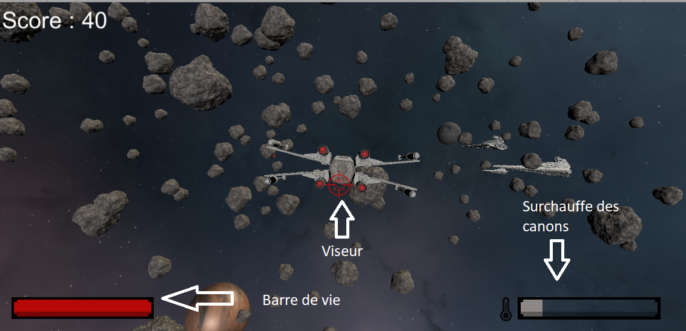

# StarShooter

# Comment jouer
Telechargez le projet <a href="https://maxence.website/files/StarWarsShooter.zip" target="_blank">Ici</a> (230Mo)
puis exécutez `Star Wars Shooter.exe`.

En jeu, utilisez les flèche directionnelle pour vous déplacer et la souris pour viser et tirer.

# Presentation

Le jeu possède 2 niveaux, le premier dans l'espace et le second sur la planète Tatooine.
L'objectif est de finir le jeu avec le meilleur score possible. Ce score augmente en fonction de différents facteurs, comme la destruction d'asteroids et l'elimination des ennemies.

